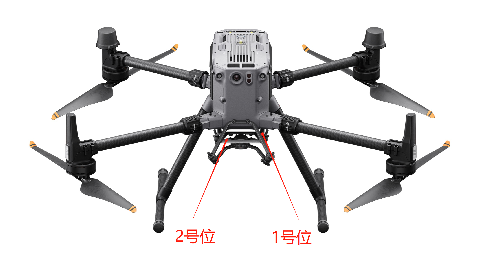
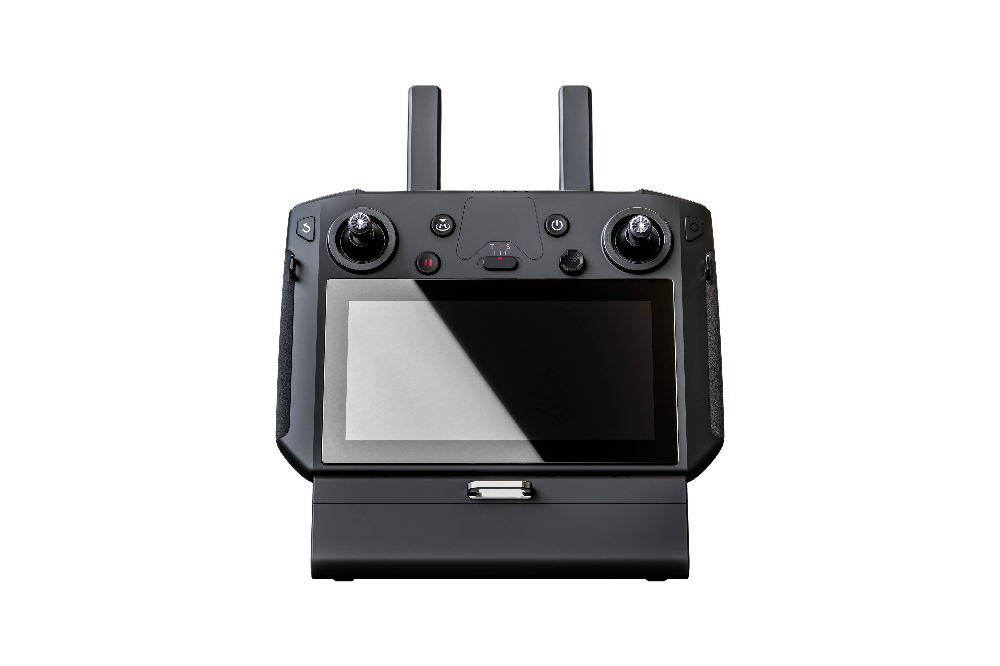
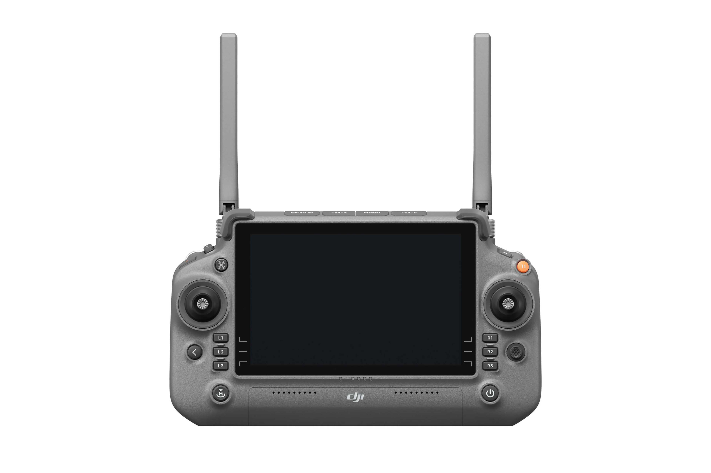
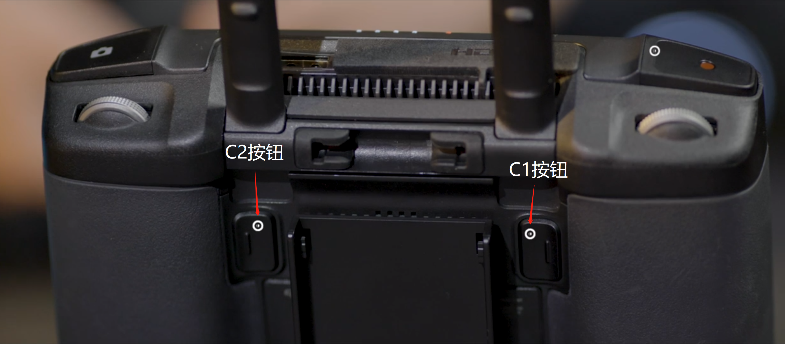
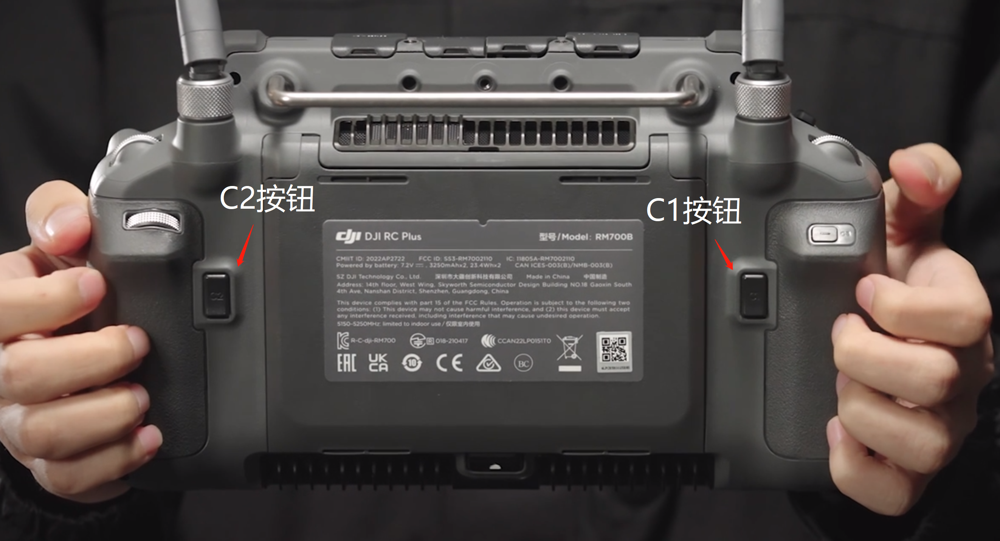

### PSDK雷达

PSDK雷达适配DJI M300与M350机型使用，飞机需搭载双云台挂架，摄像头挂载1号位，雷达挂载2号位。

注：飞机需要先上电再安装雷达。如中途重启飞机，需要将雷达取下来重新安装。

### 蓝牙雷达

蓝牙雷达适配M30系列，御3行业系列使用；请根据指导视频安装好雷达与蓝牙接收机。

### 遥控器

M300_RTK配备原装遥控器pm430，硬件配置较低，开启间隔棒识别模式会造成图传严重卡顿。

为了达到更好的使用效果，建议M300_RTK搭配DJI_RC_PLUS使用。

#### 遥控器按钮

