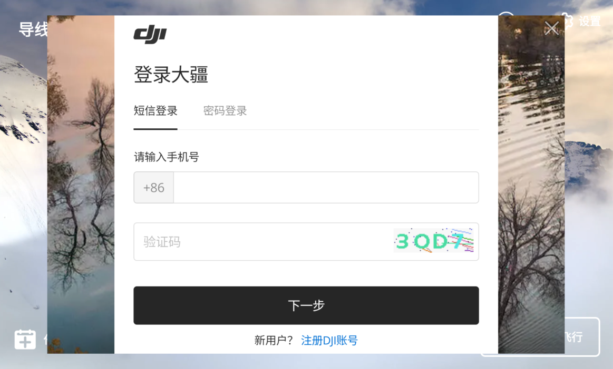
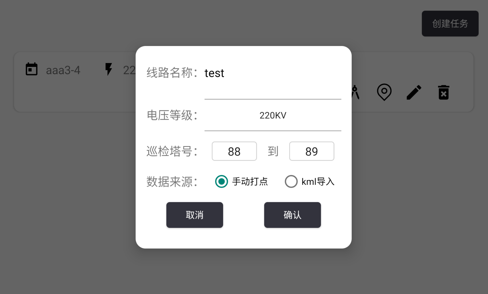
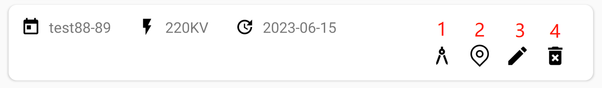
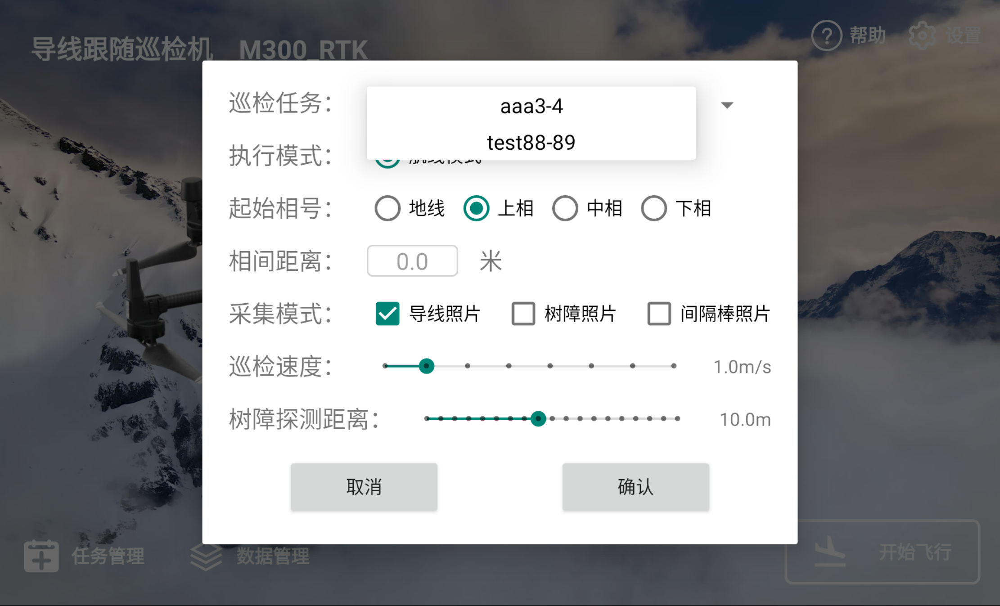
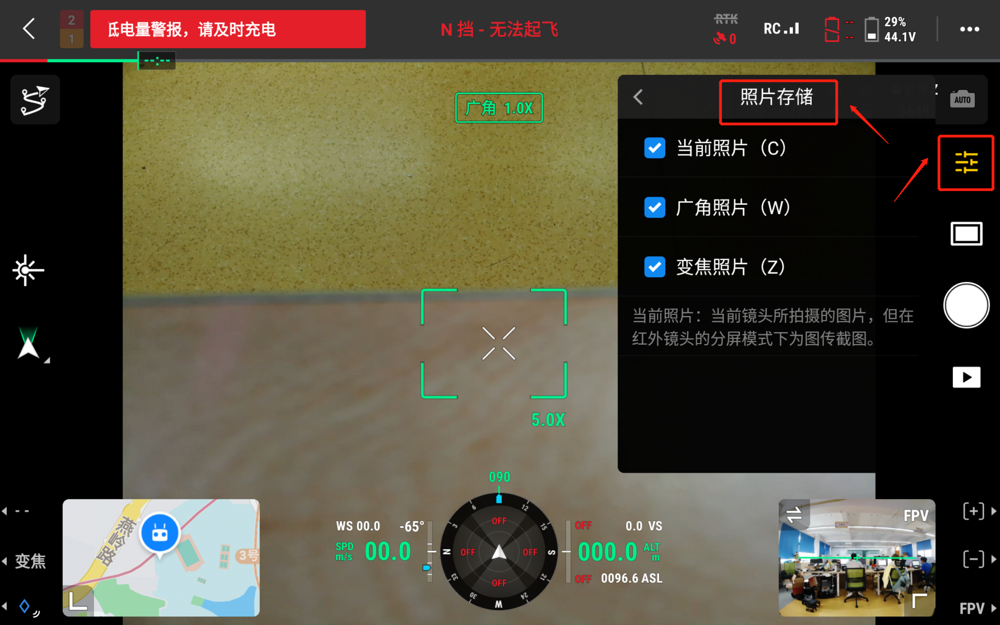

## APP初始化

飞机开机，与遥控器对频，安装云台，安装雷达，打开导线跟随巡检机app。

如飞机未连接/云台未安装，App将初始化失败。

初次使用，请登录DJI账户。

## 连接雷达

PSDK雷达在进入任务界面时会自动初始化，无需手动操作。

蓝牙雷达请点击主菜单界面的蓝牙连接按钮，连接雷达接收机的蓝牙，设备名一般以 *JZI* 开头，蓝牙出厂配对码一般为 *0000* 或 *1234* 。

## 任务管理

### 创建任务

进入任务管理界面，点击**创建任务**按钮，输入线路名称，巡检杆塔号，选择线路电压等级，创建任务。

创建任务成功后，会出现任务管理选项卡，对应有四个功能。

#### 1.记录任务点

点击任务选项卡的按钮1，进入任务点记录界面。点击*RTK*按钮，打开RTK管理面板，连接网络RTK，等待RTK定位收敛。RTK就绪后方可起飞，记录任务点。

每两基塔之间的一段导线弧垂需要按顺序打三个点，弧垂起始点——弧垂中间点——弧垂结束点。

请将飞机云台回中，机头尽量垂直朝向导线，点击下拉框选择记录点类型；根据雷达数据控制飞机离线距离，调整飞机位置使导线位于画面正中，按遥控器C2键（右手）记录点。按遥控器C1键可回删上一个记录的点。

**注：请先选择点类型再记录点。**

#### 2.显示定位

记录点完成后，点击地图按钮可查看记录点在地图上的定位。

#### 3.编辑任务点

功能待开发。

#### 4.删除任务

删除该条任务。

## 执行任务

### 配置任务参数

主菜单界面点击开始飞行，开启任务参数配置界面。

#### 1.选择对应的任务

#### 2.选择起始相号

地线需单独打点，单独巡检。

上中下相导线可共用一个任务的记录点巡检。以任务记录点为基准，例如打点时记录的是中相导线的三个点，假设相间高度差为5m，则巡检上相导线时，相间距离输入5，巡检中相导线时，相机距离输入0，巡检下相导线时，相间距离输入-5。

**注：相间距离参数仅调整高度差，请确保距离三相导线的水平距离在安全范围内！**

#### 3.选择采集模式

导线照片采集模式下，水平距离每4米拍摄一张照片。

树障照片与间隔棒照片不可同时采集。

导线照片与间隔棒照片不建议同时采集，可能造成拍摄间隔过低，生成照片失败。

**注：拍摄照片的镜头类型跟随全局，可打开大疆PILOT进行修改。**

#### 4.选择巡检速度与树障探测距离

如未选择树障采集模式，则树障探测距离不生效。

### 上传任务——开始任务

进入执行任务界面，开启RTK，RTK定位收敛后，按遥控器C1键生成任务并上传。当左下角信息提示框显示*上传任务成功*后，按遥控器C2开始任务。

任务结束后将悬停在结束点，请手动操控飞机降落。任务结束后需要保存巡检数据，耗时5-10秒，请勿在数据储存完成前退出巡检界面。

**注：巡检过程中如需中断任务，请按遥控暂停按钮或切换挡位按钮。**

## 数据管理

进入数据管理界面，每次完整执行（成功保存巡检数据）的任务会生长一条选项卡。

#### 1.导出树障报告（树障采集模式）

功能待开发。

#### 2.预览照片

点击可预览大图。

#### 3.下载照片

照片将下载到遥控器指定目录下。

内部存储空间\Android\data\com.jzi.wirefollowinginspectionv5\files\Media

#### 4.删除数据

删除该巡检记录与生成的数据。